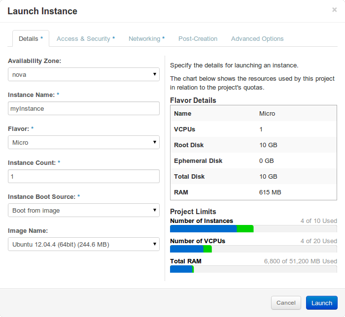
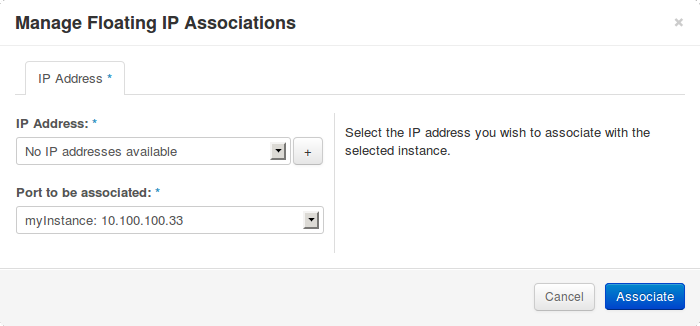
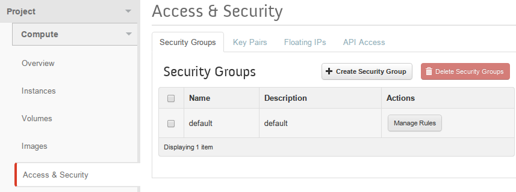

Title: Launching an Instance
Date: 2014-04-16 14:00
Tags: instances, launching, how to
Slug: launch_an_instance
Author: James Nzomo
Summary: One of the core parts of the Kili cloud is the ability to launch virtual machines on our cloud (and of course, for you to have those machines located in Kenya).  This tutorial walks you through the basics of setting up your first instance. 

###INTRO
This article illustrates how to spin up both persistent and ephemeral instances from the dashboard. 
A Persistent instance uses a block storage volume for it's root file system. This allows the operating system files (and related user data) to survive termination of the associated instance. 
An Ephemeral instance is the direct opposite of a Persistent instance. It's root volume will be destroyed once the instance is terminated!

Ephemeral instances are mostly usefull for one-off/short-lived applications whereas persistent instances will be prefferable for longterm applications.

###Pre-requisites:-

1. Active login session
2. Sufficient resource quota

###Instructions

1. Open the launch Instance modal from either:-
    * The <a href="https://dash.kili.io/project/instances/" target="_blank">instances panel</a> (`Project` &rarr; `Compute` &rarr; `Instances`) by clicking "launch instance" button at the top right of the panel.
    * The <a href="https://dash.kili.io/project/images/" target="_blank">images panel</a> (`Project    ` &rarr; `Compute` &rarr; `Images`) by clicking the "launch" button in the actions collumn of the desired image.
2. In the "Launch Instance" modal form, provide an Instance Name and Flavor. 
    * To launch an **ephemeral instance**, select "Boot from image" as your Instance Boot Source and choose your preffered image Image.  **NB.** If you opened the Launch Instance modal from the images panel, the last two optiona will already have been set 
        

    * To launch a **persistent instance**, select "Boot from image (creates a new volume)" as your Instance Boot Source, choose your preffered image and enter a device size for your new block volume. Do not check the `Delete on Terminate:` checkbox lest you defeat the purpose of your persistent instance.

3. Switch to the "Access & Security" tab and select the appropriate ssh key from the Key Pair dropdown. The selected key will be added to the default user's ssh `Authorized_Keys` file for key based authentication. If the drop down has no keys listed, click the `+` and follow the <a href="import_keypair" target="_blank">import keypair</a> guide.
    

###Post Creation
After launch, you probably want to assign a public IP to your instance.

Depending on the progress of your new VM's creation, manage your floating IP associations by clicking "Associate IP":-

1. Clicking "Associate IP" button in the VM's actions column if the VM is still spawning. (see below)
    

2. Selecting the "Associate IP" option of the "more" drop down menu in the actions collumn if the VM has successfully spun up.(see below)
     

On the popup dialog, you can either select an existing IP (if available) from the drop down or allocate a new one from the `public-net` pool by clickingt he `+` button to the right of the drop down.

If both IP address assignment and spin up was successfull, it should now be possible to ssh into your VM using "ssh [USER]@[Public IP]" where:-

[Public IP] is the public ip you associated with your instance and
[USER] is the default image user provided by distro you chose.....which will be:-

* ubuntu (for ubuntu)
* debian (for debian)
* cloud-user (for CentOS)

Hence if you spun up a CentOS image and you assigned an ip 1.2.3.4, you should access your instance by `ssh cloud-user@1.2.3.4`, provided you have the required security group rules in place. see below.
 

### A note on Security Groups
Security groups are sets of IP filter rules that are applied to an instance's networking. By default, for new accounts, the default security group denies access to port 22 from 0.0.0.0/0.

If you wish to ssh into your instance you should tweak the "Security Groups" to allow ingress SSH access on port 22 of the VM. This action is only done once for every new account.

* Go to <a href="https://dash.kili.io/project/access_and_security/?tab=access_security_tabs_security_groups_tab" target="_blank">Security Groups</a> (`Project` &rarr; `Compute` &rarr; `Access & Security`).
        
* Click on `Manage Rules` button under Actions section for the security group `default` located below the `Create/Delete Security Group` button on the right side of the dashboard.
* Under the section `Manage Security Group Rules:default`, select button `Add Rule` on the top right corner of the dashboard.
        
* As shown in the image above, select ( `Rule` &rarr; `SSH`, `Remote` &rarr; `CIDR` , `CIDR` &rarr; `0.0.0.0/0`).
